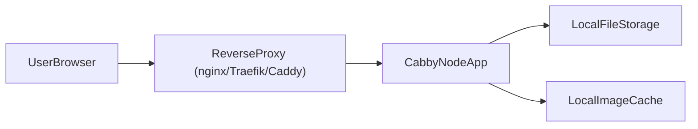

# Deployment Guide

Cabby is designed to be deploy-target agnostic. This guide shows how to run it
in production using bare Node.js (with pm2), Docker, and a reverse proxy. It
also includes an example GitLab CI setup that keeps deployment separate from
the Cabby source repository.

## Environment variables

Cabby is configured entirely via environment variables. The most important
settings are:

- `FILE_STORAGE_PATH` (required): Absolute path where Cabby stores files.
- `FILE_CACHE_PATH` (optional): Absolute path to the cache directory for
  transformed images. Defaults to `${FILE_STORAGE_PATH}/.cache` if not set.
- `PORT` (optional): Port the HTTP server listens on. Defaults to `3000`.
- `HOST` (optional): Host interface to bind to. Defaults to `0.0.0.0`.

Reserved for future use (not used by the app yet, but safe to plumb through
your infrastructure):

- `DB_URL`: Database connection string.
- `REDIS_URL`: Cache/message broker connection string.

An example configuration is provided in `.env.example`. To start, copy it to
`.env` and adjust:

```bash
cp .env.example .env
```

`.env` is already ignored from version control.

## Running in production with Node.js

To build and run Cabby directly on a server with Node.js:

```bash
npm install
npm run build

export FILE_STORAGE_PATH=/var/lib/cabby/files
export FILE_CACHE_PATH=/var/lib/cabby/cache
export PORT=3000
export HOST=0.0.0.0
export NODE_ENV=production

npm start
```

Ensure the storage and cache directories exist and are writable by the user
running the process:

```bash
mkdir -p /var/lib/cabby/files /var/lib/cabby/cache
chown -R "$USER":"$USER" /var/lib/cabby
```

## pm2 (process manager) example

For long-running processes and zero-downtime restarts, you can run Cabby under
[pm2](https://pm2.keymetrics.io/).

An example pm2 ecosystem configuration is provided at:

- `deploy/pm2/ecosystem.example.cjs`

### Server prerequisites

On the target server:

```bash
npm install -g pm2

export APP_NAME="cabby"
export DEPLOY_PATH="/var/www/cabby"
export FILE_STORAGE_PATH="/var/lib/cabby/files"
export FILE_CACHE_PATH="/var/lib/cabby/cache"
export PORT="3000"
export HOST="0.0.0.0"
export NODE_ENV="production"
```

Create directories (and adjust ownership to your deploy user as needed):

```bash
mkdir -p /var/www/cabby
mkdir -p /var/lib/cabby/files /var/lib/cabby/cache
```

### Using the example ecosystem file

Copy the example file to your server and adjust paths and instance counts as
needed:

```bash
scp deploy/pm2/ecosystem.example.cjs deploy@yourserver:/var/www/cabby/ecosystem.cjs
```

On the server, from `/var/www/cabby`:

```bash
# Install dependencies and build (one-time or on each deploy, depending on your workflow)
npm install
npm run build

# Start under pm2
pm2 start ecosystem.cjs
pm2 save
```

To restart after deploying new code:

```bash
pm2 reload ecosystem.cjs --update-env
```

## Docker

A generic Dockerfile is provided at the repository root. It uses a multi-stage
build with Node LTS:

- `Dockerfile`
- `deploy/docker-compose.example.yml`

### Build and run with Docker

Build the image:

```bash
docker build -t cabby:latest .
```

Run it:

```bash
docker run --rm \
  -p 3000:3000 \
  -e FILE_STORAGE_PATH=/var/lib/cabby/files \
  -e FILE_CACHE_PATH=/var/lib/cabby/cache \
  -e PORT=3000 \
  -e HOST=0.0.0.0 \
  -v cabby_files:/var/lib/cabby/files \
  -v cabby_cache:/var/lib/cabby/cache \
  cabby:latest
```

### Docker Compose example

The `deploy/docker-compose.example.yml` file shows a simple single-service
setup:

```yaml
services:
  cabby:
    image: cabby:latest
    environment:
      PORT: 3000
      HOST: 0.0.0.0
      FILE_STORAGE_PATH: /var/lib/cabby/files
      FILE_CACHE_PATH: /var/lib/cabby/cache
    volumes:
      - cabby_files:/var/lib/cabby/files
      - cabby_cache:/var/lib/cabby/cache
    ports:
      - "3000:3000"
```

You can adapt this to Kubernetes, Nomad, or any other orchestrator by
translating the same environment variables and volume mounts.

## Reverse proxy and TLS

Cabby is designed to run behind a reverse proxy (nginx, Traefik, Caddy, etc.)
that terminates TLS. The typical setup is:

- Cabby listens on an internal port (for example `3000`) on `HOST=0.0.0.0`.
- The reverse proxy exposes HTTPS on port 443 and forwards HTTP requests to
  Cabby.

### Nginx example

Here is a minimal nginx configuration snippet:

```nginx
upstream cabby_upstream {
  server 127.0.0.1:3000;
}

server {
  listen 80;
  server_name your-domain.example.com;

  # Redirect HTTP to HTTPS (if you terminate TLS in a separate server block)
  return 301 https://$host$request_uri;
}

server {
  listen 443 ssl http2;
  server_name your-domain.example.com;

  ssl_certificate     /etc/letsencrypt/live/your-domain.example.com/fullchain.pem;
  ssl_certificate_key /etc/letsencrypt/live/your-domain.example.com/privkey.pem;

  location / {
    proxy_pass         http://cabby_upstream;
    proxy_http_version 1.1;

    proxy_set_header Host              $host;
    proxy_set_header X-Real-IP         $remote_addr;
    proxy_set_header X-Forwarded-For   $proxy_add_x_forwarded_for;
    proxy_set_header X-Forwarded-Proto $scheme;
  }
}
```

Traefik and Caddy can be configured similarly by defining a service that
forwards to `http://cabby:3000` and enables TLS on the public entry point.

## GitLab CI + pm2 deployment (example)

To keep Cabby itself deployment-agnostic, a recommended pattern is to maintain
a separate GitLab project that handles deployment. That project:

- Clones the Cabby repository.
- Builds the application.
- Synchronizes the build to your server.
- Restarts Cabby under pm2.

### Suggested GitLab project layout

- `cabby-deploy` (GitLab project)
  - `ecosystem.cjs` (pm2 config for your environment)
  - `.gitlab-ci.yml` (pipeline that builds and deploys Cabby)
  - Optional shell scripts (`deploy.sh`) to keep the CI job clean.

Configure GitLab CI variables in that project for:

- `CABBY_REPO`: URL of the Cabby repository.
- `CABBY_REF`: branch, tag, or commit to deploy (for example `main`).
- `DEPLOY_HOST`, `DEPLOY_USER`: SSH connection to the target server.
- `SSH_PRIVATE_KEY`: private key for `DEPLOY_USER`.
- `APP_NAME`, `DEPLOY_PATH`, `FILE_STORAGE_PATH`, `FILE_CACHE_PATH`,
  `PORT`, `HOST`, `NODE_ENV`, and any future variables.

### Example .gitlab-ci.yml (in cabby-deploy)

```yaml
image: node:22-alpine

stages:
  - build
  - deploy

variables:
  CABBY_DIR: "/builds/${CI_PROJECT_NAMESPACE}/${CI_PROJECT_NAME}/cabby"

before_script:
  - apk add --no-cache git openssh-client rsync

build_cabby:
  stage: build
  script:
    - git clone "$CABBY_REPO" "$CABBY_DIR"
    - cd "$CABBY_DIR"
    - git checkout "$CABBY_REF"
    - npm ci
    - npm run build
  artifacts:
    paths:
      - cabby/
    expire_in: 1 week

deploy_production:
  stage: deploy
  needs: ["build_cabby"]
  only:
    - tags
    - main
  script:
    - mkdir -p ~/.ssh
    - eval "$(ssh-agent -s)"
    - echo "$SSH_PRIVATE_KEY" | tr -d '\r' | ssh-add -
    - ssh-keyscan -H "$DEPLOY_HOST" >> ~/.ssh/known_hosts

    - rsync -az --delete cabby/ "${DEPLOY_USER}@${DEPLOY_HOST}:${DEPLOY_PATH}"
    - scp ecosystem.cjs "${DEPLOY_USER}@${DEPLOY_HOST}:${DEPLOY_PATH}/ecosystem.cjs"

    - |
      ssh "${DEPLOY_USER}@${DEPLOY_HOST}" bash -lc '
        set -e

        mkdir -p "'"${FILE_STORAGE_PATH}"'" "'"${FILE_CACHE_PATH}"'"

        cd "'"${DEPLOY_PATH}"'"
        npm ci --omit=dev

        export APP_NAME="'"${APP_NAME}"'"
        export DEPLOY_PATH="'"${DEPLOY_PATH}"'"
        export FILE_STORAGE_PATH="'"${FILE_STORAGE_PATH}"'"
        export FILE_CACHE_PATH="'"${FILE_CACHE_PATH}"'"
        export PORT="'"${PORT}"'"
        export HOST="'"${HOST}"'"
        export NODE_ENV="'"${NODE_ENV}"'"

        if pm2 describe "$APP_NAME" > /dev/null 2>&1; then
          pm2 reload ecosystem.cjs --update-env
        else
          pm2 start ecosystem.cjs
        fi

        pm2 save
      '
```

This is intentionally generic and meant as a starting point. You can adapt it
to your own branching strategy, server layout, and secrets management.

## Architecture overview

The following diagram shows a typical production setup:



This layout works for both bare-metal and containerized deployments. In
containerized environments, `fileStorage` and `fileCache` are typically
backed by volumes.

